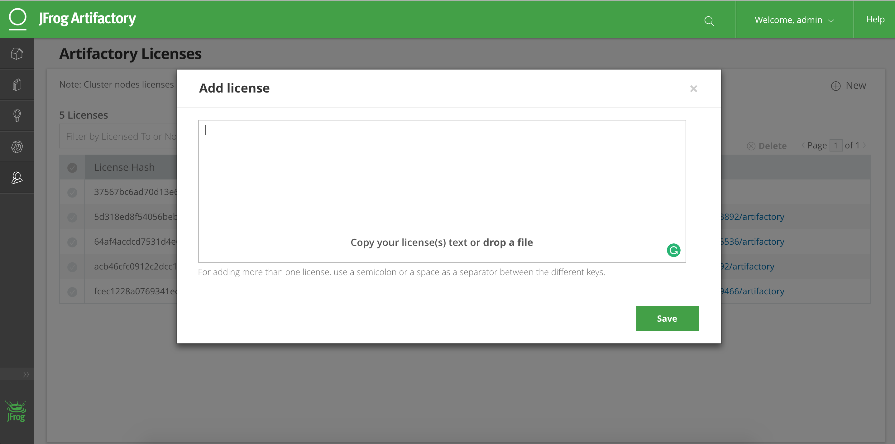

## How to set up Artifactory Enterprise on DC/OS

[Artifactory Enterprise](https://www.jfrog.com/artifactory/versions/#High-Availability) is a highly available installation of Artifactory. It does this by using a load balancer to balance requests across multiple Artifactory instances.


## Prerequisites

- DC/OS 1.8 or later with at least one public agent
- [DC/OS CLI installed](https://dcos.io/docs/1.8/usage/cli/install/) and configured to use your cluster
- Database (MySQL, Oracle, MS SQL Server or Postgres)
- Artifactory Enterprise license
- NFS directory mounted to each node

## Setting up Artifactory Enterprise with NFS

### 1. Mount NFS Storage to Each Private Node of DC/OS Cluster
All nodes should share the same file storage. We recommend to use NFS.

As an example, if `artifactoryha.mount.com:/artifactory` is the mount point, mount it to `/var/data/artha` on each private node of DC/OS with the following command:

```
sudo mount artifactoryha.mount.com:/artifactory /var/artifactory/
```

#### NOTE: Provide permission to write and create subdirectories to `/var/artifactory/`.

### 2. Installation Options File

Create a new file, called `artifactory-enterprise-options.json`, with the content below. 

Be sure to:

- replace `service.license` with your own license string, separating multiple licenses with a comma (`,`) and no additional whitespace
- replace `service.database.user` and `service.database.password` with the correct values
- replace `DATABASE_NAME` within `service.database.connection-string` with the correct database name

```
{
  "service": {
    "name": "artifactory",
    "cpus": 2,
    "mem": 2048,
    "nodes": 1,
    "licenses": "$ARTIFACTORY_ENTERPRISE_LICENSES",
    "host-volume": "/var/artifactory",
    "database": {
      "type": "mysql",
      "host": "mysql.marathon.mesos",
      "port": 3306,
      "url": "jdbc:mysql://mysql.marathon.mesos:3306/DATABASE_NAME?characterEncoding=UTF-8&elideSetAutoCommits=true",
      "user": "jfrogdcos",
      "password": "jfrogdcos"
    }
  },
  "pro": {
    "external-volumes": {
      "enabled": false,
      "provider": "dvdi",
      "driver": "rexray"
    }
  },
  "high-availability": {
    "enabled": true,
    "unique-nodes": true
  }
}
```


#### NOTE: (Optional) API Key of Artifactory generated by Artifactory-Primary to fetch license from Artifactory-Primary

### 3. Install Artifactory Enterprise through DC/OS CLI

Run the following DC/OS CLI command to install Artifactory Enterprise:

```
dcos package install --options=artifactory-primary-options.json artifactory
```

## Install Artifactory-lb

Once Artifactory is up and running, [follow this guide to set up Artifactory-lb](artifactory-lb.md).

## Scaling Artifactory Enterprise

Add more license for secondary nodes in Artifactory UI. As showed in screenshot.


Run the following DC/OS CLI command to scale Artifactory Enterprise to 2 instances. By running this command Artifactory will add 2nd node as secondary node in Artifactory HA cluster. 

```
dcos marathon app update artifactory instances=2
```

