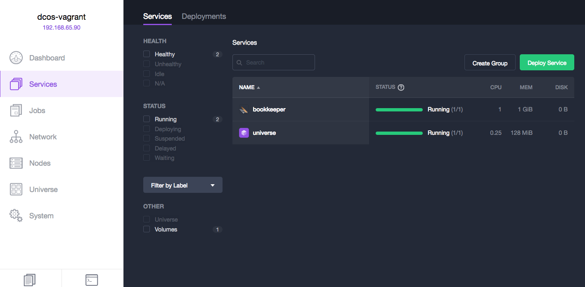
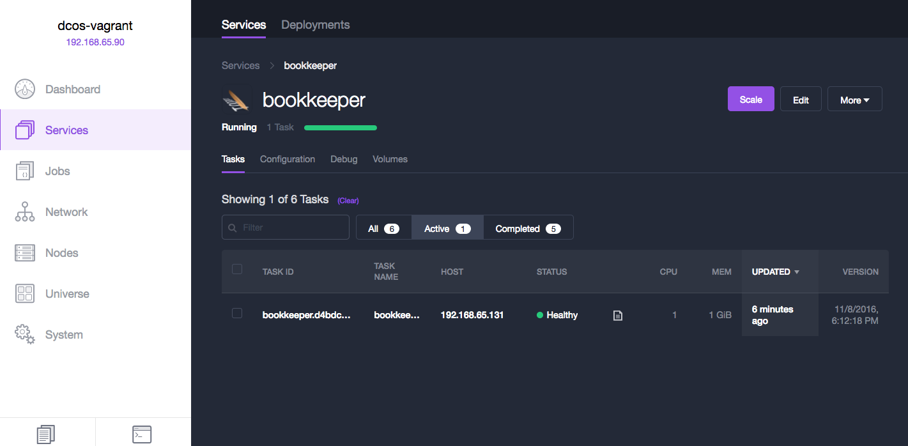
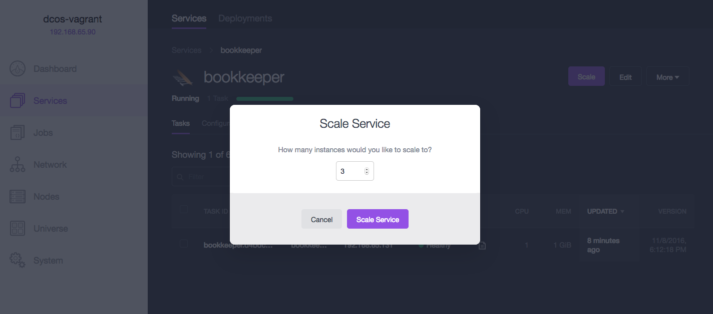
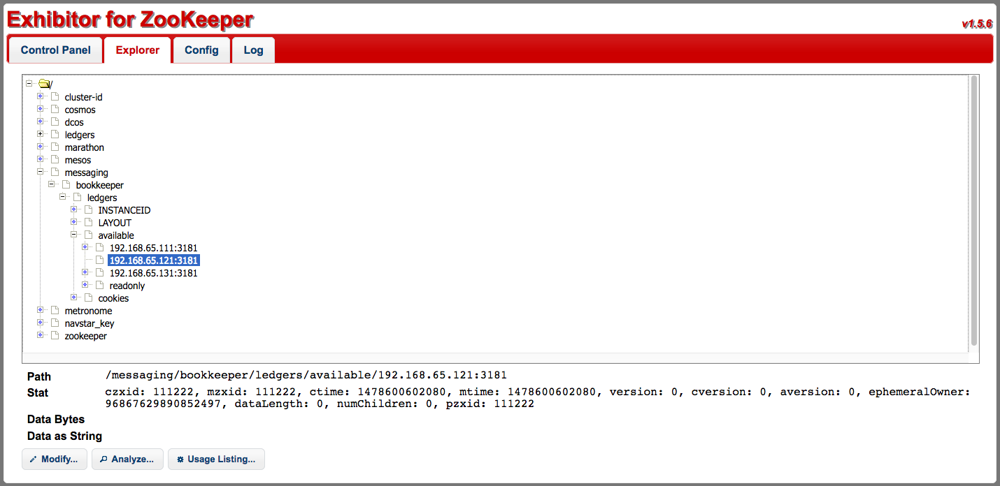

# How to use Bookkeeper package on DC/OS

[Bookkeeper](http://bookkeeper.apache.org/) BookKeeper is a replicated log service which can be used to build replicated state machines. A log contains a sequence of events which can be applied to a state machine. BookKeeper guarantees that each replica state machine will see all the same entries, in the same order. 
One bookkeeper instance is called a bookie, By default this package deploy 1 bookie. Usually we should deploy at least 3 bookies to start a bookkeeper cluster.

- Estimated time for completion: 5 minutes
- Target audience: Anyone who wants to deploy a bookkeeper cluster
- Scope: Covers the basics in order to get you started with bookkeeper on DC/OS.

## Prerequisites

- A running DC/OS 1.8 cluster with at least 3 nodes, each at least having 1 CPU, 1G of memory and 10GB of persistent disk storage in total.
- [DC/OS CLI](https://dcos.io/docs/1.8/usage/cli/install/) installed.
- Zookeeper service instance could be accessed(by default at: zk://master.mesos:2181).

## Install Bookkeeper

The DC/OS CLI provides a convenient way to deploy applications on your DC/OS cluster:

```bash
$ dcos package install bookkeeper --yes
Welcome using bookkeeper. Be sure zk could access, by default it's master.mesos:2181,  bk default service port:3181.
Installing Marathon app for package [bookkeeper] version [4.3.4]
bookkeeper on DCOS installed successfully!
```

This command installs the `bookkeeper` DC/OS CLI subcommand and starts an instance of the Bookkeer(a bookie) service with its default configuration under its default name, `bookkeeper`. Bookie instance use host mode of network, and by defaut it exports service at "agent_ip:3181". 
Now click on the Services tab in the DC/OS UI to watch Bookkeeper start up:



Click on the Bookkeeper service to reveal the tasks that has started:



You now have a bookie running on DC/OS! You could click "Scale" tab at the top right of the window, to deploy more bookies.



The zookeeper contains all the avilable bookies information, In this deploy, bookkeeper use the zookeeper instance provided by DCOS, and could access through exhibitor: "http://master.dcos/exhibitor". Congratulations, if you have find the avilable bookies here.



## Use bookkeeper 

Now that bookkeeper cluster is running you can create ledgers, fill bookie with log entries.

You could try it with [DistributedLog](http://distributedlog.incubator.apache.org). DistributedLog is A high-throughput, low-latency replicated log service, offering durability, replication and strong consistency as essentials for building reliable real-time applications. And DistributedLog perfers using bookkeeper as backend streaming storage.
There is a more detailed example of how DistributedLog using bookkeeper cluster at this [link](http://distributedlog.incubator.apache.org/docs/latest/deployment/cluster).

After this deploy of bookkeeper, [Download](http://distributedlog.incubator.apache.org/docs/latest/start/download) DistributedLog bin, and try start from [Create Namespace](http://distributedlog.incubator.apache.org/docs/latest/deployment/cluster#id13), then create streams and write/read on these streams.

## Further reading

### Unintsall

Use the following commands to shut down and delete your bookkeeper service:

```bash
$ dcos package uninstall bookkeeper
Uninstalled package [bookkeeper] version [4.3.4]
Thank you for using bookkeeper.
```

### Configuration options

There are a number of configuration options, which can be specified in the following
way:

```bash
$ dcos package install --config=<JSON_FILE> bookkeeper
```

where `JSON_FILE` is the path to a JSON file. For a list of possible
attribute values and their documentation see

```bash
$ dcos package describe --config bookkeeper
```

### Further Information


- The BookKeeper user mailing list is: user@bookkeeper.apache.org.
- The BookKeeper developer mailing list is : dev@bookkeeper.apache.org.
- The Bookkeeper [JIRA](https://issues.apache.org/jira/browse/BOOKKEEPER)

- [DistributedLog](http://distributedlog.incubator.apache.org/)
