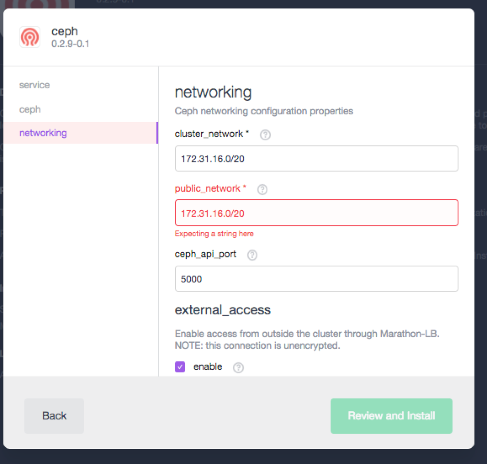
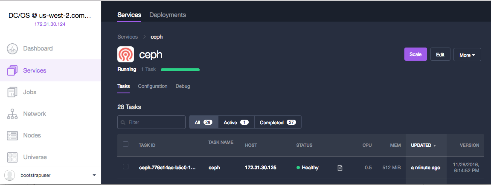
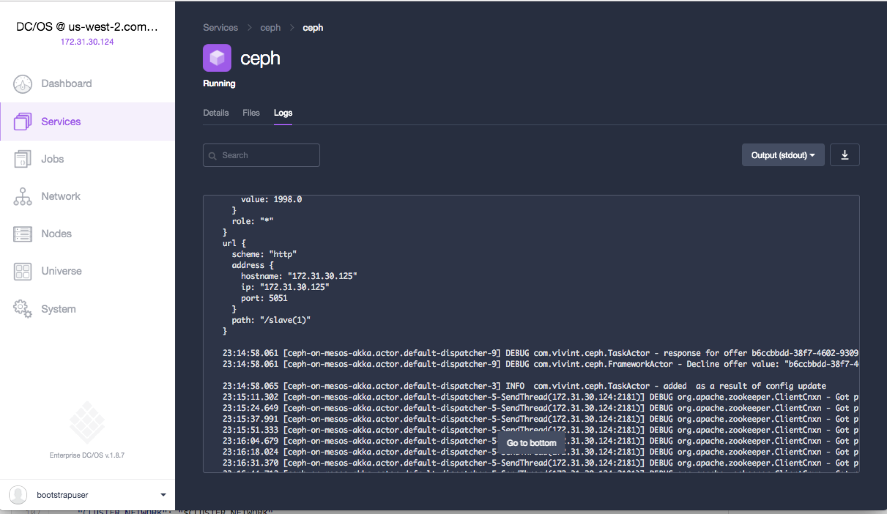
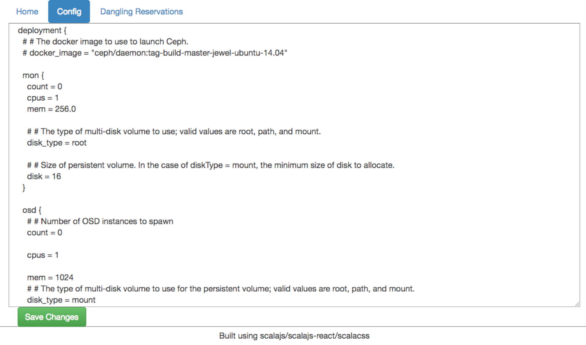
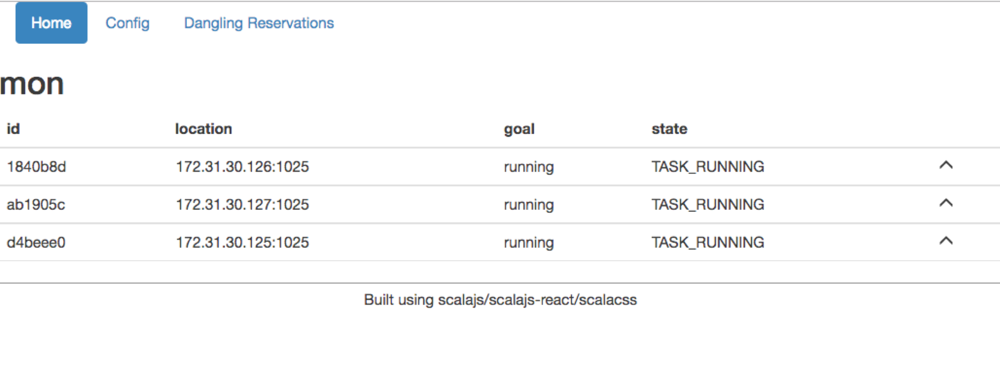
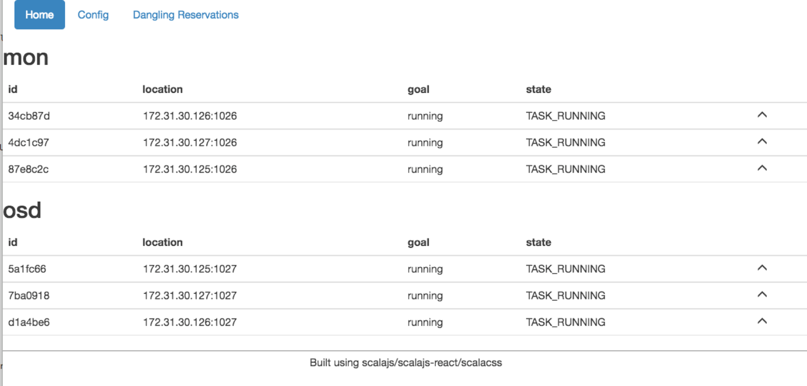
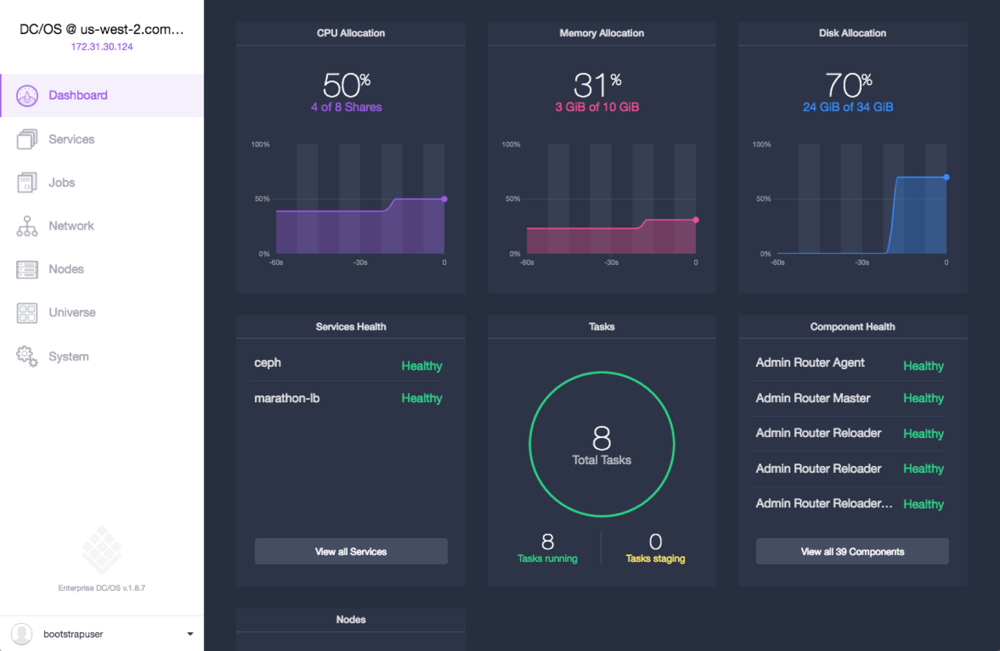
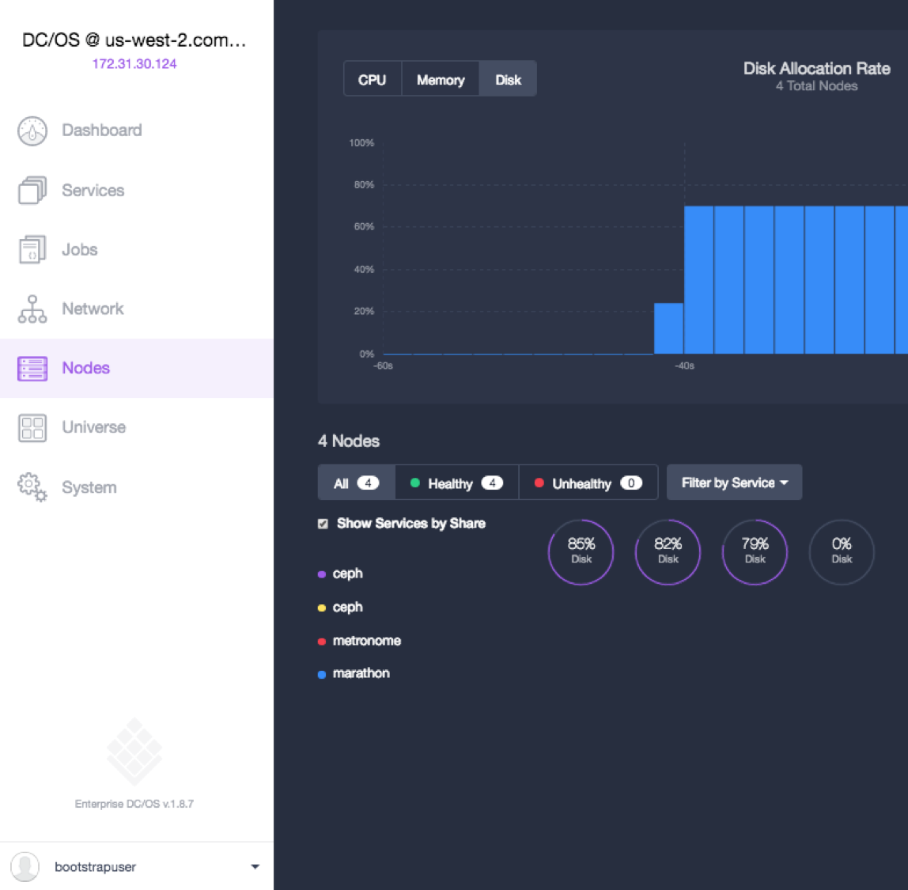
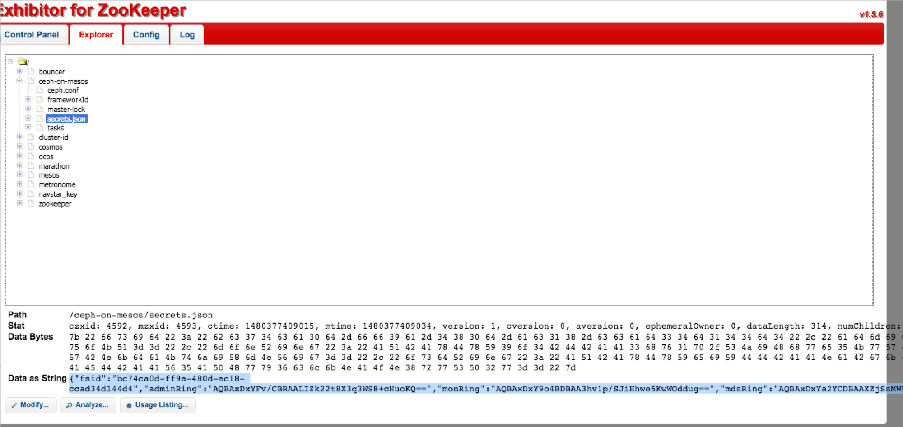

 

Ceph is a free-software storage platform that implements object storage on a single distributed computer cluster, and provides interfaces for object-, block- and file-level storage. Ceph aims primarily for completely distributed operation without a single point of failure, scalable to the exabyte level, and freely available.

Ceph replicates data and makes it fault-tolerant,using commodity hardware and requiring no specific hardware support. As a result of its design, the system is both self-healing and self-managing, aiming to minimize administration time and other costs.

- Estimated time for completion: 45 minutes
- Target audience: Anyone who wants to deploy a distributed storage solution on DC/OS. 
- This package requires an intermediate/advanced DC/OS skill set.

**Scope**:
 - Configure/format the DC/OS agents that will run the Ceph OSDs.
 - Configure and launch the Ceph-on-mesos package.
 - Configure and launch the components of the Ceph Framework from the framework's UI.
 - Configure the node(s) to be used as Ceph clients/consumers.

**Terminology**:

- **Monitor**:  Processes that keep track of active and failed cluster nodes.
- **OSD**: Object storage devices that actually store the content of files on a local filesystem of the DC/OS nodes where they run.
- **Ceph node**:  A DC/OS node running a Ceph OSD (and possibly a Ceph Monitor too.)
- **Ceph client**:  A computer running the client part of Ceph to consume storage services provided by it.

**Table of Contents**:

- [Prerequisites](#prerequisites)
- [Ceph Node configuration](#ceph-node-configuration)
- [Install Ceph](#install-ceph)
  - [Validate installation](#validate-installation)
- [Configure Ceph](#configure-ceph)
  - [Configure Ceph Monitors](#configure-ceph-monitors)
  - [Validate Ceph Monitor configuration](#validate-ceph-monitor-configuration)
  - [Configure Ceph OSDs](#configure-ceph-osds)
  - [Validate Ceph OSD configuration](#validate-ceph-osd-configuration)
- [Configure Ceph clients](#configure-ceph-clients)
  - [Validate Ceph client configuration](#validate-ceph-client-configuration)
- [Use Ceph](#use-ceph)
- [Uninstall](#uninstall)

# Prerequisites

- A running DC/OS v1.8 cluster with at least 3 private agents. Ceph-on-Mesos REQUIRES at least 3 nodes to install monitors and OSDs on in order to achieve a quorum.
- All nodes in the cluster that will be part of the Ceph installation MUST have a separate volume for Ceph OSDs to use.
  * As an example, this can be achieved in AWS EC2 by just adding a second volume to each instance before installing.
- Marathon-LB MUST be running in the cluster.
- A node in the cluster with a working DC/OS CLI.
- NTP (or an equivalent time sync service) needs to be running in all nodes of the cluster.

The installation/configuration process has 4 stages:

# Ceph Node configuration

- Nodes where OSDs will run MUST have at least a separate volume. Having more than one volume per node is also accepted and the code below will also format/mount it automatically.
- These will be formatted as XFS, and mounted as `/dcos/volumeX` for DC/OS to use.

## Instructions:

Each node that will become a Ceph node running a Ceph OSD and a Ceph monitor MUST have at least one separate volume for exclusive use by Ceph. More than one volume per node can be configured and the instructions below will accomodate them automatically.

Save the name of the volumes to be used by Ceph as a list separated with space. For volumes provisioned in AWS EC2 they would have the format:

```bash
CEPH_DISKS="/dev/xvdb /dev/xvdc" 
```

On each node of the cluster that will eventually become a Ceph node, run the code below (you can just copy&paste it on each node). NOTE: Substitute the value of `CEPH_DISKS` for the name of the volumes used for Ceph as explained above:

```bash
# List to format as XFS for ceph, SPACE separated as in: 
# "/dev/hda /dev/hdb /dev/hdc"
CEPH_DISKS="/dev/xvdb" 
# just a name for the script below.
CEPH_FDISK=ceph_fdisk_headless.sh 

# Format disks as XFS
cat > ./$CEPH_FDISK << EOF
#!/bin/sh
hdd="$CEPH_DISKS"
EOF
cat >> ./$CEPH_FDISK << 'EOF'
for i in $hdd;do
echo "n
p
1


w
"|fdisk $i;mkfs.xfs -f $i;done
EOF
chmod +x ./$CEPH_FDISK
./$CEPH_FDISK && rm -f $CEPH_FDISK

# loop through the disks/volumes in $CEPH_DISKS, mount them under /dcos/volumeX
WORDS=($CEPH_DISKS)
COUNT=${#WORDS[@]}
for  ((i=0; i<COUNT; i++)); do
  mkdir -p /dcos/volume$i
  #i-th word in string
  DISK=$( echo $CEPH_DISKS | cut -d " " -f $(($i+1)) )
  mount $DISK /dcos/volume$i
done
```

You can check that the operations above worked with:

```bash
mount | grep "/dcos/volume"
```

Expected output:
```bash
/dev/xvdb on /dcos/volume0 type xfs (rw,relatime,seclabel,attr2,inode64,noquota)
```

Finally, in all nodes to be used for Ceph, finish the configuration by stopping the `dcos-mesos-slave` process, clearing the resource cache, and restarting it:

```bash
systemctl stop dcos-mesos-slave
rm -f /var/lib/dcos/mesos-resources
rm -f /var/lib/mesos/slave/meta/slaves/latest
/opt/mesosphere/bin/make_disk_resources.py /var/lib/dcos/mesos-resources
```

Expected output:
```bash
Looking for mounts matching pattern "on\s+(/dcos/volume\d+)\s+"
Found matching mounts : [('/dcos/volume0', 8049)]
ERROR: Missing key 'MESOS_WORK_DIR'
```

Restart the DC/OS mesos agent:
```
systemctl start dcos-mesos-slave
```

Check that the new volumes are visible to Mesos-agent with:
```
cat /var/lib/dcos/mesos-resources | grep volume
```

Expected output:
``` bash
# MESOS_RESOURCES='[{"name": "ports", "type": "RANGES", "ranges": {"range": [{"begin": 1025, "end": 2180}, {"begin": 2182, "end": 3887}, {"begin": 3889, "end": 5049}, {"begin": 5052, "end": 8079}, {"begin": 8082, "end": 8180}, {"begin": 8182, "end": 32000}]}}, {"type": "SCALAR", "name": "disk", "role": "*", "disk": {"source": {"type": "MOUNT", "mount": {"root": "/dcos/volume0"}}}, "scalar": {"value": 8049}}, {"type": "SCALAR", "name": "disk", "role": "*", "scalar": {"value": 4031}}]'

``` 

After running these commands on at least three nodes of the DC/OS cluster, proceed to the next step to install the Ceph package.

# Install Ceph

## Install Ceph from the DC/OS GUI

Log into DC/OS, go to Universe, and select the Ceph package from Universe. Select `Advanced Installation`. Two parameters are ***MANDATORY***:

- ***cluster_network*** : Network where the Ceph nodes live. This is usually the host network where the DC/OS nodes live. This network is assumed to be trusted. E.g. `172.31.0.0/20`

- ***public_network*** : Network that the Ceph services are exposed on, where the Ceph clients/consumers live. This is often the same as cluster_network unless Ceph is to be exposed outside the cluster. E.g. `172.31.0.0/20`

Once the package is configured according to your installation and needs, click on "Review and Install", and finally on "Install".



## Install Ceph rom the DC/OS CLI

Log into a terminal where the DC/OS CLI is installed and has connectivity with the cluster. The two mandatory parameters referenced above can be passed as options to the DC/OS CLI by creating a `ceph-options.json` file with the following content (Modify the values as per your own installation/desire) :

```bash
{
  "service": {
    "name": "ceph"
  },
  "ceph": {
    "cpus": 1,
    "mem": 1024
  },
  "networking": {
    "cluster_network": "172.31.16.0/20",
    "public_network": "172.31.16.0/20",
    "ceph_api_port": 5000,
    "external_access": {
      "enable": true,
      "external_access_port": 5000,
      "virtual_host": "ceph.example.org"
    }
  }
}
```

Create and save the `ceph-options.json` file, then launch the Ceph DC/OS package with:

```bash
dcos package install --yes --options ./ceph-options.json ceph
```

## Validate installation

### Validate from GUI

After installation, the package will be running under the `Services` tab:



You can check the package instance’s correct functioning by clicking on the package name and looking at the task’s logs:



### Validate from CLI

After installation, you can check the correct functioning with:

```bash
dcos package list|grep ceph
ceph         0.2.9-0.1  /ceph         ---      Ceph, a free-software storage platform, implements object storage on a single distributed computer cluster, and provides interfaces for object-, block- and file-level storage. Ceph aims primarily for completely distributed operation without a single point of failure, scalable to the exabyte level, and freely available.
```

Once this process is completed, the Ceph scheduler should be running in your cluster and waiting the be configured. In the next step, we will access the Ceph package's configuration and management interface to configure the scheduler to launch and configure the working components of the Ceph framework, which include the Monitor and OSD units.

# Configure Ceph

Once the Ceph package has been installed in your DC/OS cluster, the Ceph configuration interface  will be available through Marathon-LB in the public node of your cluster. The port where it's available is configurable with the ***external_access_port*** parameter available in the "Advanced Installation" options. By default, it will be on port 5000. 

In order to configure and launch the components of the Ceph package, open up the Ceph "config" page at `http://your_public_node:5000`.



The Ceph configuration page automatically updates the service's configuration when this page is changed.

## Configure Ceph Monitors

To get started, go to the "Monitors" section and modify the number of Ceph Monitors in it to reflect the amount and size you desire. 

```
mon {
 count = 3         #number of private agents in the cluster
 cpus = 0.2		  #desired CPU per monitor
 mem = 256
}
```

Modifying these values and clicking "Save Changes" will automatically launch them in the cluster.

### Validate Ceph Monitor configuration

After clicking on "Save", go to the "Home" page and watch the monitor processes be created and progress until they all are in the `TASK_RUNNING` state. Please note this can take a few minutes.



## Configure Ceph OSDs

Back in the "Config" section of the Ceph configuration UI, go to the "osd" section and modify the count of OSDs in it to reflect the amount and size you desire. Modifying these values and clicking "Save" will automatically launch them in the cluster:

```
osd {
   # # Number of OSD instances to spawn
    count = 3
    cpus = 0.5
    mem = 512
	disk = 5000      # example of value in MB: reserve 5G out of the disk space available in each host

```

Modifying these values and clicking "Save Changes" will automatically launch them in the cluster.

### Validate Ceph OSD configuration

After clicking on "Save", go to the "Status" page and watch the OSD processes be created and progress until they all are in the `TASK_RUNNING` state. Please note this may take a few minutes.



When all Monitors and OSDs are in the `TASK_RUNNING` state, your Ceph cluster is installed and ready to be used.

Additionally, you will quickly notice how OSDs start reserving storage resources in the cluster nodes by looking at the DC/OS UI in the Dashboard:



The Services tab also shows how Ceph is using storage resources:



## Configure Ceph clients 

Once the Ceph cluster is up, we can configure clients to consume volumes provided by Ceph. In order to do that, we need to install and configure the Ceph client sofware on the nodes that will consume volumes from Ceph. These clients can be nodes that are members of the DC/OS cluster (for example, in order to provide volumes to services and containers running on DC/OS), or consumers that sit outside of the DC/OS cluster. 

The parameter ***public_network*** [configured in the Ceph package](#install-ceph) controls the subnet/mask that authorized Ceph clients need to live in in order to be allowed to use Ceph services.

***NOTE***: these commands are an example for CentOS 7.2. Ceph clients are available for all major Linux distributions and other Operating Systems. These clients should be able to connect to Ceph running on DC/OS, but the configuration may be slightly different. Consult the documentation provided by your Operating System vendor for details.

### Ceph clients: prerequisites

As a preliminary step for the instructions below, `jq` must be installed in the clients. If it isn't installed, you can install it  with:

```bash
wget http://stedolan.github.io/jq/download/linux64/jq
chmod +x ./jq
cp jq /usr/bin
```

### Ceph clients: Find out and export Ceph secrets

In order for the clients to authenticate to the Ceph cluster, the Ceph package creates a set of Secrets that are stored in Zookeeper. In order to use these secrets in the Ceph clients, you can log into the Zookeeper instance running on your DC/OS cluster through the Exhibitor administration interface available at:

```
http://$DCOS_IP:8181
```

Where `$DCOS_IP` is the IP or DNS name where your DC/OS cluster is available.

In the Exhibitor interface, open the "Explorer". Open up the root ZK folder by expanding with the button on the left of the folder icon.
Go to "ceph-on-mesos", click on "secrets.json", and finally copy the entire "Data as String" available at the bottom. 



Example:
```bash
{"fsid":"d8e57f50-c26f-43d6-b678-95640beb27f4","adminRing":"AQC6/TRYdsbZhhAAzzQfp8a1HVS5N+PDRzQXMg==","monRing":"AQC6/TRY/vZ+hxAA6GClC+goMWh/zFunwhd8WA==","mdsRing":"AQC6/TRYm4x/hxAA5snbgMzzu8pjgtS0cADxiQ==","osdRing":"AQC6/TRYWkuAhxAAlqc4OYu4T9hL9TT83F+yng==","rgwRing":"AQC6/TRYSAGBhxAAEo5N3oey9ekU99tWEQOjAw=="}
```

One this string is copied, export it in the node that you want to use as a Ceph client:

```bash
export SECRETS='{<paste JSON blob here>}'
# example: export SECRETS='{"fsid":"bc74ca0d-ff9a-480d-ac18-ccad34d144d4","adminRing":"AQBAxDxYFv/CBRAALIZk22t8X3q3WS8+cHuoKQ==","monRing":"AQBAxDxY9o4BDBAA3hv1p/SJiHhwe5KwWOddug==","mdsRing":"AQBAxDxYa2YCDBAAXZjSsMWBNkdaKtjiXmNVig==","osdRing":"AQBAxDxYeiYDDBAANaBgkJi98oA1chOk4tvXUQ==","rgwRing":"AQBAxDxY4RAEDBAAV5APHwy6clkNAON8rwSP2w=="}'

```

Check that the FSID was correctly parsed:

```bash
echo "$SECRETS" |jq .fsid
```

Expected output:

```bash
"d8e57f50-c26f-43d6-b678-95640beb27f4"
```

With these values exported in the node to be used as client, you can now create the Ceph configuration files. These will include `ceph.conf`, `ceph.mon.keyring`, and `ceph.client.admin.keyring`.

### Ceph clients: create required configuration files

First, create the Ceph configuration directory that will host the configuration files:

```bash
mkdir -p /etc/ceph
```

Then create each one of the configuration files as follows:

#### ceph.conf

NOTE: make sure to swap out HOST_NETWORK below with the value [configured in the Ceph package](#install-ceph) as HOST_NETWORK:

```bash
export HOST_NETWORK=172.31.0.0/20       #Use the value for the network where your DC/OS nodes live.
rpm --rebuilddb && yum install -y bind-utils
export MONITORS=$(for i in $(dig srv _mon._tcp.ceph.mesos|awk '/^_mon._tcp.ceph.mesos/'|awk '{print $8":"$7}'); do echo -n $i',';done)
cat <<-EOF > /etc/ceph/ceph.conf
[global]
fsid = $(echo "$SECRETS" | jq .fsid)
mon host = "${MONITORS::-1}"
auth cluster required = cephx
auth service required = cephx
auth client required = cephx
public network = $HOST_NETWORK
cluster network = $HOST_NETWORK
max_open_files = 131072
mon_osd_full_ratio = ".95"
mon_osd_nearfull_ratio = ".85"
osd_pool_default_min_size = 1
osd_pool_default_pg_num = 128
osd_pool_default_pgp_num = 128
osd_pool_default_size = 3
rbd_default_features = 1
EOF
```

#### ceph.mon.keyring

```bash
cat <<-EOF > /etc/ceph/ceph.mon.keyring
[mon.]
 key = $(echo "$SECRETS" | jq .monRing -r)
 caps mon = "allow *"
EOF
```

#### ceph.client.admin.keyring

```bash
cat <<-EOF > /etc/ceph/ceph.client.admin.keyring
[client.admin]
  key = $(echo "$SECRETS" | jq .adminRing -r)
  auid = 0
  caps mds = "allow"
  caps mon = "allow *"
  caps osd = "allow *"
EOF
```

### Ceph clients: Install Ceph client software

```bash
yum install -y centos-release-ceph-jewel
yum install -y ceph
```

### Ceph clients: Validate configuration

Check ceph is working on the client by verifying it can get a correct connection to the cluster:

```bash
/bin/python /bin/ceph mon getmap -o /etc/ceph/monmap-ceph
```

Output should look like:
```bash
got monmap epoch 3
```

As an additional test, check the status of the Ceph cluster:

```bash
/bin/python /bin/ceph -s
```

Output should look like:
```bash
    cluster bc74ca0d-ff9a-480d-ac18-ccad34d144d4
     health HEALTH_WARN
            mon.172.31.30.125 low disk space
            mon.172.31.30.126 low disk space
            mon.172.31.30.127 low disk space
     monmap e3: 3 mons at {172.31.30.125=172.31.30.125:1026/0,172.31.30.126=172.31.30.126:1026/0,172.31.30.127=172.31.30.127:1026/0}
            election epoch 6, quorum 0,1,2 172.31.30.125,172.31.30.126,172.31.30.127
     osdmap e7: 3 osds: 3 up, 3 in
            flags sortbitwise
      pgmap v55: 64 pgs, 1 pools, 0 bytes data, 0 objects
            399 MB used, 24146 MB / 24546 MB avail
                  64 active+clean
```

## Use Ceph

Once Ceph is running on DC/OS, and Ceph client packages have been installed and configured in your client, you can add a new volume to your client using RBD.

NOTE: these commands are an example for CentOS 7.2. Ceph clients are available for all major Linux distributions and for other Operating Systems. These clients should be able to connect to Ceph running on DC/OS, but the configuration may be slightly different. Consult the documentation provided by your Operating System vendor for details.

Adapt these variables to your desired setup and paste into your client:

```bash
VOLUME_NAME="test"
VOLUME_MOUNT_PATH="/mnt/ceph/my_volume"
VOLUME_SIZE="1G"
```

Then use these commands to create a RBD volume using Ceph, format it and mount it under the PATH defined in the variable above:

```bash
rbd create --size=$VOLUME_SIZE $VOLUME_NAME
VOLUME_DEV=$( rbd map $VOLUME_NAME )
echo $VOLUME_DEV
#Expected output: "/dev/rbdX" where X is the volume number
mkfs.xfs -f $VOLUME_DEV
mkdir -p $VOLUME_MOUNT_PATH
mount $VOLUME_DEV $VOLUME_MOUNT_PATH
```

Output should look like:

```bash
# echo $VOLUME_DEV
/dev/rbd0

# mkfs.xfs -f $VOLUME_DEV
meta-data=/dev/rbd0              isize=256    agcount=9, agsize=31744 blks
         =                       sectsz=512   attr=2, projid32bit=1
         =                       crc=0        finobt=0
data     =                       bsize=4096   blocks=262144, imaxpct=25
         =                       sunit=1024   swidth=1024 blks
naming   =version 2              bsize=4096   ascii-ci=0 ftype=0
log      =internal log           bsize=4096   blocks=2560, version=2
         =                       sectsz=512   sunit=8 blks, lazy-count=1
realtime =none                   extsz=4096   blocks=0, rtextents=0
```


You can verify the correct functioning with:

```bash
mount |grep rbd0
/dev/rbd0 on /mnt/ceph/my_volume type xfs (rw,relatime,seclabel,attr2,inode64,sunit=8192,swidth=8192,noquota)
cd $VOLUME_MOUNT_PATH
touch "DOES_THIS_WORK_-_YES_-_DCOS_ROCKS"
ls
```

You can repeat this sequence to create additional volumes that are hosted in your Ceph cluster.

# Uninstall

To uninstall Ceph:

```bash
$ dcos package uninstall ceph
```

Use the [framework cleaner](https://docs.mesosphere.com/1.8/usage/managing-services/uninstall/#framework-cleaner) script to remove your Ceph instance from ZooKeeper and to destroy all data associated with it. The script requires several arguments, the values for which are derived from your service name:

- `framework-role` is `ceph-role`
- `framework-principal` is `ceph-principal`
- `zk_path` is `ceph-on-mesos`

## Further resources

1. [Official Ceph project homepage](https://www.ceph.com)
2. [Ceph on Mesos framework homepage](https://github.com/vivint-smarthome/ceph-on-mesos)
