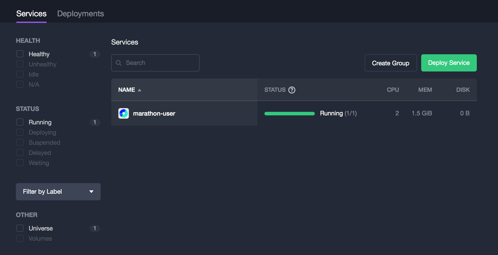
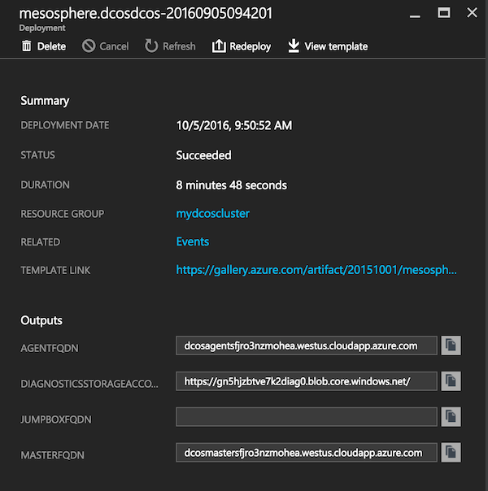
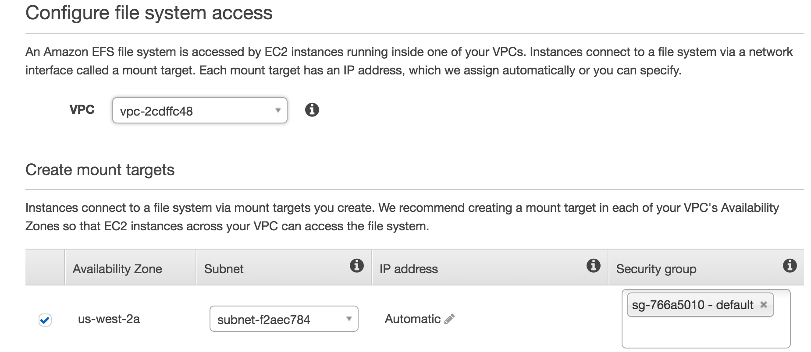
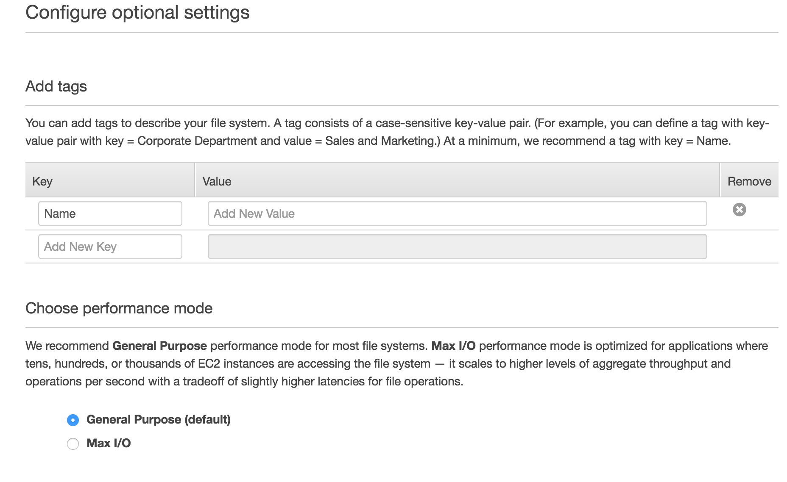
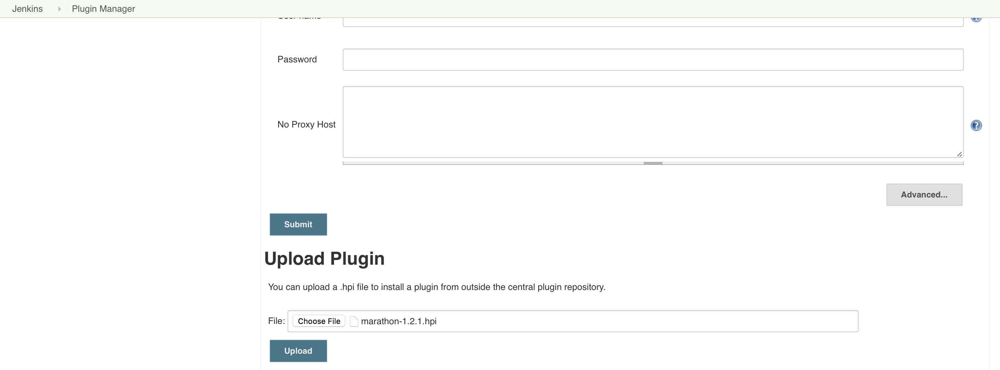
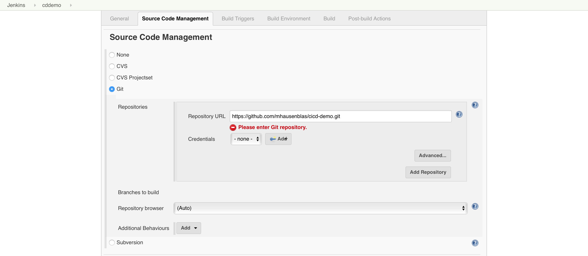
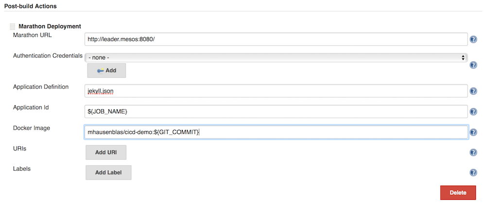

# How to use  Jenkins on DC/OS

[Jenkins](https://jenkins-ci.org/) is a popular Continuous Integration (CI) automation server 
and framework with hundreds of plugins (GitHub, Docker, Slack, etc.) available. Running Jenkins
on DC/OS allows you to scale your CI infrastructure by dynamically creating and destroying 
Jenkins agents as demand increases or decreases, and enables you to avoid the statically partitioned
infrastructure typical of a traditional Jenkins deployment.

- Estimated time for completion: up to 45 minutes
- Target Audience:
 - Operators
 - Application admins
 - Quality/Release engineers
 - CI/CD admins
- Scope: You'll learn how to install Jenkins and how to use it to build and deploy a Docker image on Marathon.

**Table of Contents**:

- [Prerequisites](#prerequisites)
- Install Jenkins in a [development environment](#install-jenkins-in-a-development-environment)
- Install Jenkins in a [production environment](#install-jenkins-in-a-production-environment)
- Build a Docker image and [deploy it via Marathon](#build-a-docker-image-and-deploy-it-via-marathon)
- [Uninstall Jenkins](#uninstall-jenkins)

## Prerequisites

- An account on Docker Hub.
- A running DC/OS 1.8 cluster with at least 2 nodes.
- [DC/OS CLI](https://dcos.io/docs/1.8/usage/cli/install/) installed.
- A user-specific [Marathon instance](https://docs.mesosphere.com/1.8/usage/service-guides/marathon/install/) with the name `marathon-user`, serving as the deployment platform:



Note that Jenkins works by persisting information about its configuration and build history as files on disk. Therefore, we have two options for deploying
[Jenkins on DC/OS](https://docs.mesosphere.com/1.8/usage/service-guides/jenkins/): pin it to a single node (good for dev/test environments), or use a network file system mount such as NFS or CIFS, which is recommended for production environments.

## Install Jenkins in a development environment

If you want to run Jenkins in a development or test environment, it's trivial to pin it to a single agent in the DC/OS cluster. Create the file
`options.json` with the configuration below, modifying `pinned-hostname` to correspond to an agent IP in your DC/OS cluster (for example, via `dcos node`):

```bash
$ cat options.json
{
    "storage": {
        "pinned-hostname": "10.0.3.230"
    }
}
```

Note that for a complete list of the configuration options available for the Jenkins package, see the [Jenkins package definition](https://github.com/mesosphere/universe/tree/version-3.x/repo/packages/J/jenkins) in the Mesosphere Universe.

Once you've created `options.json`, you can then install Jenkins by running the following command:

```bash
$ dcos package install jenkins --options=options.json
WARNING: If you didn't provide a value for `host-volume` in the CLI,
YOUR DATA WILL NOT BE SAVED IN ANY WAY.

Continue installing? [yes/no] yes
Installing Marathon app for package [jenkins] version [2.0.1-2.7.4]
Jenkins has been installed.
```

Once ready, Jenkins will appear as a service in the DC/OS dashboard.

## Install Jenkins in a production environment

Running Jenkins in a production environment will require that each machine in the cluster has an external volume mounted at the
same location. External volumes can be backed by any number of systems, including NFS, CIFS, Ceph, and others. This will allow Jenkins to persist data
to the external volume while still being able to run on any agent in the cluster, preventing against outages due to machine failure.

If you already have a mount point, great! Create an `options.json` file that resembles the following example:

```bash
$ cat options.json
{
    "service": {
        "name": "jenkins-prod",
        "cpus": 2.0,
        "mem": 4096
    },
    "storage": {
        "host-volume": "/mnt/jenkins"
    }
}
```

Then, install Jenkins by running the following command:

```bash
$ dcos package install jenkins --options=options.json
```

If you don't have a file share set up and are looking for a solution, continue to the next section for instructions on how to set up a shares using
CIFS on Microsoft Azure or NFS on Amazon EFS.

### Creating a CIFS file share on Microsoft Azure

First, you need to create a [Storage Account](https://portal.azure.com/#create/Microsoft.StorageAccount-ARM) in the **same resource group** in which you've launched your DC/OS cluster. In this particular example, let's create the storage account `mh9storage` in the resource group `mh9`:


Now, create a file share. In the example shown here it's called `jenkins`:


### Mounting an Azure CIFS file share on Ubuntu

Log into the DC/OS master node. To determine the master, look up `MASTERFQDN` in the `Outputs` section of the deployment in Azure:



Next, add the private SSH key locally:

```bash
$ ssh-add ~/.ssh/azure
Identity added: /Users/mhausenblas/.ssh/azure (/Users/mhausenblas/.ssh/azure)
```

Next, if you haven't already, tunnel the master node using the following command (note that the `-L 8000:localhost:80` is
forwarding port `8000` from your local machine to port `80` on the remote host:

```bash
$ ssh azureuser@dcosmastersfjro3nzmohea.westus.cloudapp.azure.com -A -p 2200 -L 8000:localhost:80
```

On this node you can now [mount the File Share](https://azure.microsoft.com/en-us/documentation/articles/storage-how-to-use-files-linux/) we
created in the previous step. 

First, let's make sure that the CIFS mount utils are available:

```bash
$ sudo apt-get update && sudo apt-get -y install cifs-utils
```

And now we can mount the file share:

```bash
azureuser@dcosmastersfjro3nzmohea:~$ sudo mkdir -p /mnt/jenkins
azureuser@dcosmastersfjro3nzmohea:~$ sudo mount -t cifs    \
  //mh9storage.file.core.windows.net/jenkins /mnt/jenkins \
  -o vers=3.0,username=REDACTED,password=REDACTED,dir_mode=0777,file_mode=0777
```

Be sure to replace the `REDACTED` value for the `username` and `password` options with your username and password. Note that the value for `password` is
`KEY2` from `Access keys`, as shown here:


To check if the file share works, we upload a test file via the Azure portal:


If all is well, you should be able to list the contents of the mounted file share on the DC/OS master node:

```bash
azureuser@dcosmastersfjro3nzmohea:~$ ls -al /mnt/jenkins
total 1
-rwxrwxrwx 1 root root 19 Mar 20 11:21 test.txt
```

Finally, using the `pssh` tool, configure each of the DC/OS agents to mount the file share.

```bash
$ sudo apt-get install pssh
$ cat pssh_agents
10.0.3.226
10.0.3.227
10.0.3.228
10.0.3.229
10.0.3.230
10.0.7.0

$ parallel-ssh -O StrictHostKeyChecking=no -l azureuser -h pssh_agents "if [ ! -d "/mnt/jenkins" ]; then mkdir -p "/mnt/jenkins" ; fi"
$ parallel-ssh -O StrictHostKeyChecking=no -l azureuser -h pssh_agents "mount -t cifs //mh9storage.file.core.windows.net/jenkins /mnt/jenkins -o vers=3.0,username=REDACTED,password=REDACTED,dir_mode=0777,file_mode=0777"
```

### Creating an NFS file share with Amazon EFS

To start, open the [Amazon EFS console](https://console.aws.amazon.com/efs/), click `Create file system` and then `Create file system`. Make sure you are in the same availability zone as as your DC/OS cluster.

Select the VPC of your DC/OS cluster and click `Next Step`:



Optional settings can be left blank, or you can add tags to the volume if desired.  Click `Next Step`:



You will see a `Review and create` screen. Double check that the appropriate availability zone is selected, then click `Create File System`:


Once your EFS volume has been created, Amazon provides a link (click `here`) on instructions for mounting on Amazon, Red Hat, and SuSE Linux:


See below for instructions on mounting an NFS volume on CoreOS.

### Mounting an NFS file share on CoreOS

First, get the link to the EFS NFS fileshare you created in the previous step, replacing `xxxxxxxx` with your unique EFS ID:

```bash
echo $(curl -s http://169.254.169.254/latest/meta-data/placement/availability-zone).fs-xxxxxxxx.efs.us-west-2.amazonaws.com:/
```

Next, follow our documentation for [mounting NFS volumes](https://dcos.io/docs/1.8/administration/storage/nfs/) to mount your EFS NFS filesystem on each of your DC/OS agents.

## Build a Docker image and deploy it via Marathon

Note that in the following we assume you have an account on Docker Hub (or a similar Docker registry service).

By default, the Jenkins package is configured with a Docker-in-Docker agent that allows you to build Docker images on top of DC/OS. Nothing else is needed
on your part.

Mesosphere maintains an open source Marathon plugin for Jenkins, which allows you to easily deploy an application to Marathon. To install it, perform the
following steps:

  1. Download the `.hpi` file for the latest Marathon plugin from the [mesosphere/jenkins-marathon-plugin/](https://github.com/mesosphere/jenkins-marathon-plugin/releases) repo.
  2. Upload the `.hpi` plugin file via the `Advanced` tab within the Jenkins plugin manager:
  
  3. Restart Jenkins to load the new plugin.

Next, you configure a Jenkins job that clones the [mesosphere/cd-demo](https://github.com/mesosphere/cd-demo) GitHub repository, builds the image, pushes it to Docker Hub, and deploys it to Marathon:



For the build step, you may use (or adapt) the following build script:

```bash
#!/bin/bash
IMAGE_NAME="${DOCKER_USERNAME}/${JOB_NAME}:${GIT_COMMIT}"

docker login -u ${DOCKER_USERNAME} -p ${DOCKER_PASSWORD} -e ${DOCKER_EMAIL}
docker build -t $IMAGE_NAME .
docker push $IMAGE_NAME
```

Finally, configure a post-build step using the Marathon plugin:


An example of a Marathon deployment follows: 

- We use the internal IP address of the System Marathon for the `Marathon URL` field, that is, `http://leader.mesos:8080/`
- For the `Application Definition` field, that is the Marathon app spec file, we use in this example `jekyll.json` 
- For the `Application Id` field we use `${JOB_NAME}`
- For the `Docker Image` field use your own Docker image, in our example `mhausenblas/cicd-demo:${GIT_COMMIT}`

The resulting config should looks something akin to this:



## Uninstall Jenkins

To uninstall Jenkins using the DC/OS CLI, run the following command:

```
$ dcos package uninstall jenkins
```

