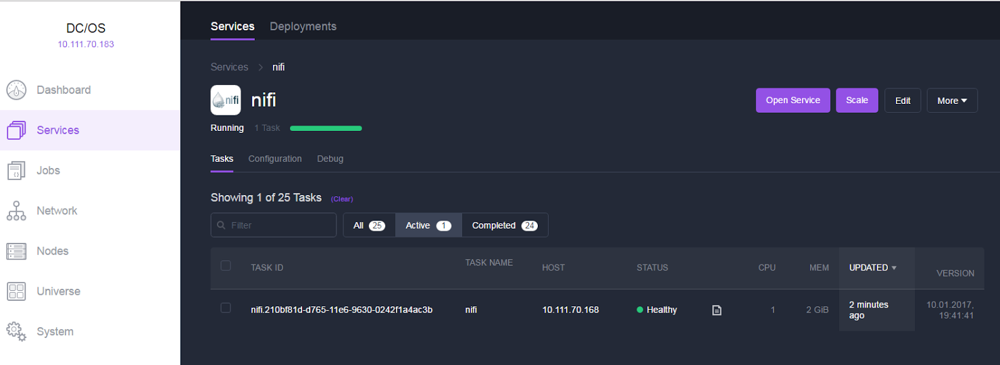

# How to use Apache Nifi on DC/OS

[Nifi](http://nifi.apache.org) is an easy to use, powerful, and reliable system to process and distribute data.
Running Apache Nifi on DC/OS allows you to manage your data flow very easile. Saving data on the HDFS or consuming data from Kafka will be easily scalable.

- Estimated time for completion: 5 minutes
- Target audience: Data engineers
- Scope: Install and use Apache Nifi.

**Table of Contents**:

- [Prerequisites](#prerequisites)
- [Install Nifi](#install-nifi)
- [Use Nifi](#use-nifi)
- [Uninstall Jenkins](#uninstall-jenkins)

## Prerequisites

- A running DC/OS 1.8 cluster with at least 1 node.
- [DC/OS CLI](https://dcos.io/docs/1.8/usage/cli/install/) installed.


## Install Nifi


```bash
$ dcos package install nifi
Nifi on DC/OS is in alpha and there may be bugs, incomplete features, incorrect documentation or other discrepancies.
Continue installing? [yes/no] yes
Installing Marathon app for package [nifi] version [1.1.1]
Nifi has been successfully installed.
Documentation can be found at https://nifi.apache.org/docs.html
Please keep in mind that first start of nifi can take a more than 60 seconds, so please be patient.
```

After this, you should see the Nifi service running via the `Services` tab of the DC/OS UI:




## Use Nifi

You typically want to access Nifi via a web browser outside of the DC/OS cluster. To access the Apache Nifi UI from outside of the DC/OS cluster you can use [Marathon-LB](https://dcos.io/docs/1.8/usage/service-discovery/marathon-lb/), which is recommended for production usage.

You can also use [Admin Router](https://dcos.io/docs/1.8/development/dcos-integration/#-a-name-adminrouter-a-admin-router) to provide access to the Apache NIfi UI, which is fine for dev/test setups.

In the following we will use the Endpoint URL. 

 - Go to the **Services** tab
 - Select "nifi" in the list of running services
 - Once the Nifi service is `Healthy`,
   Select the "nifi" task.
 - Click the Endpoint URL to open the Calico status page in a new tab.


## Uninstall Nifi

To uninstall Nifi:

```bash
$ dcos package uninstall nifi
```

## Further resources

1. [Nifi docs](https://nifi.apache.org)