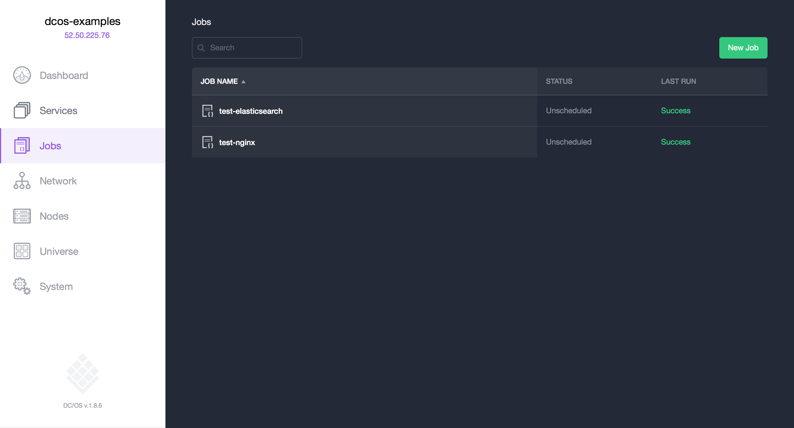

# DC/OS 1.8 Examples Test Suite

This is the DC/OS 1.8 examples test suite (ETS) to make sure all the examples here actually work as described.

## Prerequisites 

- A running DC/OS 1.8.x cluster with 5 private agent + 1 public agent nodes each with at least 2 CPUs and at least 7 GB RAM, recommended instance types on AWS is [m3.xlarge](https://aws.amazon.com/ec2/instance-types/) and on Azure [D2](https://azure.microsoft.com/en-us/pricing/details/virtual-machines/linux/).
- [DC/OS CLI](https://dcos.io/docs/1.8/usage/cli/install/) installed, version `0.4.14` or above.

## Run tests

In order to run the ETS, clone the repo and change to the `1.8/test-suite/` directory.
The following assumes that you're logged in, that is, that `dcos auth login` has been executed
(note that if you're unsure about this step, run `dcos config show core.dcos_acs_token` which should 
show the HTTP API token).

To execute all tests (can take up to xx min):

    # make sure no local or cluster resources are hanging around:
    $  ./clean-up.sh
    # run all tests
    $  ./run-all.sh
    etting up DC/OS 1.8 Examples Test Suite
    Trying to run [[test-elasticsearch]]
    [[test-elasticsearch]] submitted
    Trying to run [[test-nginx]]
    [[test-nginx]] submitted
    All tests submitted, see DC/OS Jobs UI for results ...

Once you see `run-all.sh` exiting, head over to the DC/Os Jobs UI where you see the test results:

## Troubleshooting

As a preparation, capture the HTTP API token in the environment variable `MY_OAUTH_TOKEN`:

    $ export MY_CLUSTER_URL=$(dcos config show core.dcos_url)
    $ export MY_OAUTH_TOKEN=$(dcos config show core.dcos_acs_token)

To run a certain test, say `test-elasticsearch`, do the following:

    $ sed -i "" "s#MY_CLUSTER_URL#$MY_CLUSTER_URL#g" test-elasticsearch.json
    $ sed -i "" "s/MY_OAUTH_TOKEN/$MY_OAUTH_TOKEN/g" test-elasticsearch.json
    $ dcos job remove test-elasticsearch
    $ dcos job add test-elasticsearch.json
    $ dcos job run test-elasticsearch

To see the results:

    $ export TARGET_TEST=test-elasticsearch
    
    # what was happening on STDOUT:
    $ dcos task --completed log $(dcos task --completed | grep $TARGET_TEST | tail -1 | awk '{print $5}')
    
    # what was happening on STDERR:
    $ dcos task --completed log $(dcos task --completed | grep $TARGET_TEST | tail -1 | awk '{print $5}') stderr