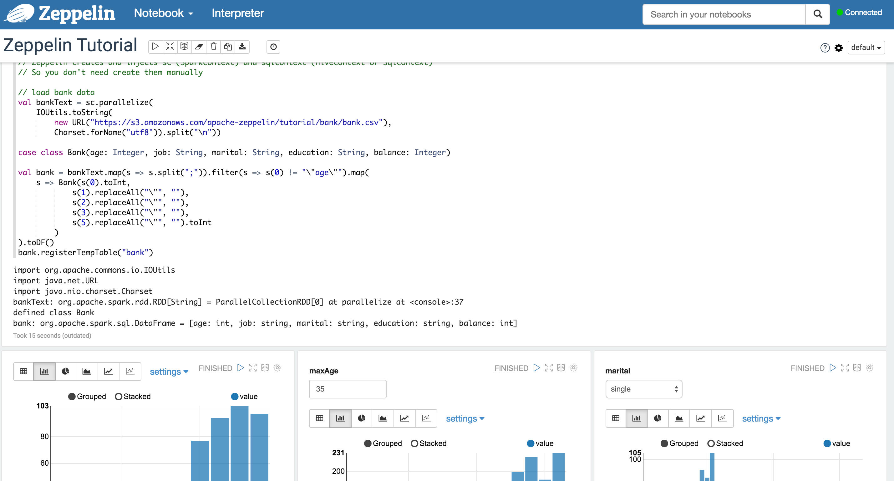

# How to use Apache Zeppelin on DC/OS

[Apache Zeppelin](https://zeppelin.apache.org/)is a web-based notebook that enables interactive data analytics. For example, you can use it as a front-end for [Apache Spark](https://github.com/dcos/examples/tree/master/1.8/spark).

- Estimated time for completion: 20 minutes
- Target Audience: Data scientists and data engineers that want an interactive data analytics tool.
- Scope: Install and use Zeppelin in DC/OS Kafka.

**Table of Contents**:

- [Prerequisites](#prerequisites)
- [Install Zeppelin](#install-kafka)
- [Produce and consume messages](#produce-and-consume-messages)
 - [List Kafka client endpoints](#list-kafka-client-endpoints)
 - [Produce a message](#produce-a-message)
 - [Consume a message](#consume-a-message)
- [Uninstall Kafka](#uninstall-kafka)

## Prerequisites

- A running DC/OS 1.8 cluster with 2 agents (one private, one public) each with 2 CPUs and 2 GB of RAM available.
- [DC/OS CLI](https://dcos.io/docs/1.8/usage/cli/install/) installed.

## Install Zeppelin

You typically want to access Zeppelin via a web browser outside of the DC/OS cluster. To access the Zeppelin UI from outside of the DC/OS cluster you have two of options available: launching it on a public node or via [Marathon-LB](https://dcos.io/docs/1.8/usage/service-discovery/marathon-lb/). The latter option is the recommended one for production usage.

The following section will show you how to launch Zeppelin on a public node. This is fine for testing but be aware that this is going to make Zeppelin available on the public Internet (i.e. access from `0.0.0.0`) and with it, everyone out there can access your data and launch Spark jobs on your DC/OS cluster.

To launch Zeppelin on a public node, create a JSON file `options.json` with the following content:

```bash
$ cat options.json
{
  "zeppelin": {
    "role": "slave_public"
  }
}
```

Then, you can install Zeppelin like so:

```bash
$ dcos package install --options=options.json zeppelin
Installing Marathon app for package [zeppelin] version [0.5.6]
DC/OS Zeppelin is being installed!

	Documentation: https://docs.mesosphere.com/zeppelin/
	Issues: https://docs.mesosphere.com/support/
```

After this, you should see the Zeppelin service running via the `Services` tab of the DC/OS UI:


Clicking on the `Open Service` button in the right upper corner leads to the Zeppelin UI:


To get started with Zeppelin you can create a new Notebook and paste the following Spark snippet in Scala:

```
val rdd = sc.parallelize(1 to 5)
rdd.sum()
```
After you've pressed the `Run all paragraphs` button (the triangle/play button in the menu), you should see something like the following


Next, you can check out the built-in tutorial in form of a Notebook called [Zeppelin Tutorial](http://zeppelin.apache.org/docs/0.5.6-incubating/tutorial/tutorial.html):



## Further resources

1. [DC/OS Zeppelin Official Documentation](https://docs.mesosphere.com/1.8/usage/service-guides/zeppelin/)
1. [Zeppelin docs](http://zeppelin.apache.org/docs/0.5.6-incubating/)


