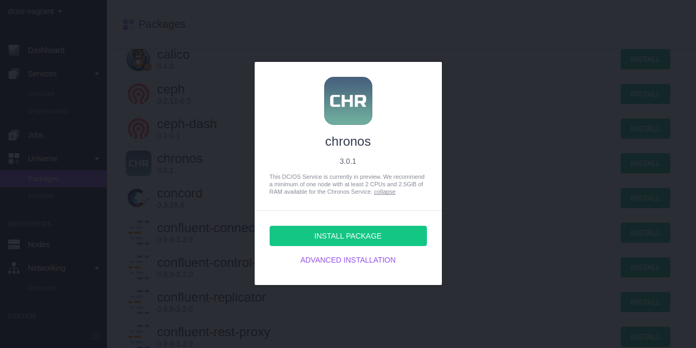
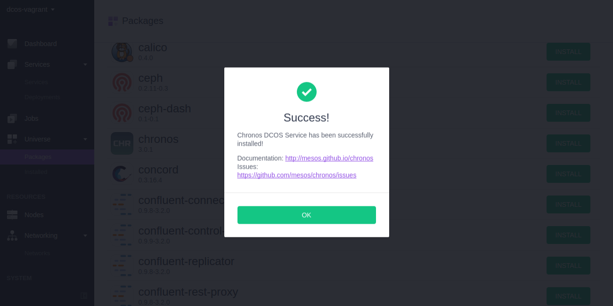
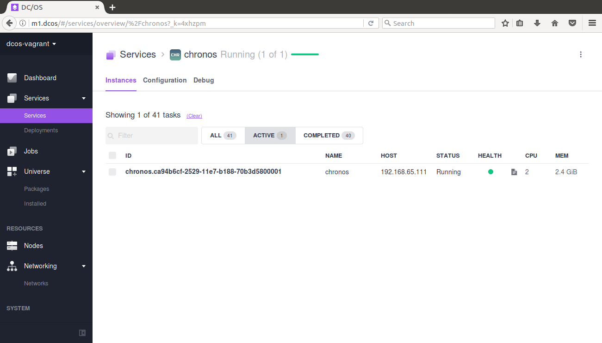
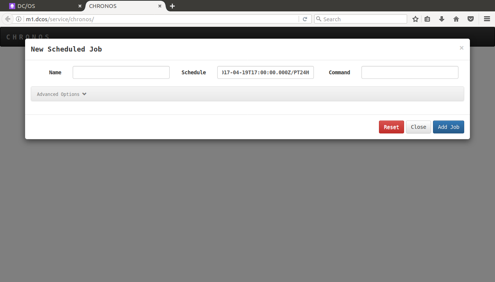
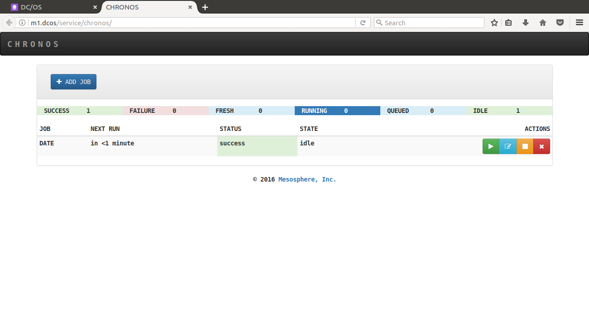
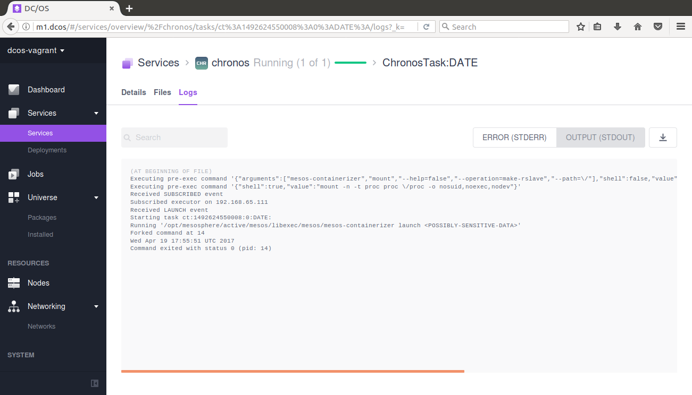

# How to use Chronos on DC/OS

Note: DC/OS now includes a built-in [job scheduler](https://dcos.io/docs/1.9/usage/jobs/), which is the preferable way to schedule batch jobs.

[Chronos](http://mesos.github.io/chronos/) is still available on DC/OS, representing the original way to run batch jobs. It is a highly-available, distributed job scheduler, providing the a robust way to run batch jobs. Chronos schedules jobs across the DC/OS cluster and manages dependencies between jobs in an intelligent way.


- Estimated time for completion: 15 minutes
- Target audience:
 - Data engineers
 - Data scientists
 - DevOps engineers
- Scope: Setup and usage of a batch scheduler for DC/OS.

**Table of Contents**:

- [Prerequisites](#prerequisites)
- [Install Chronos](#install-chronos)
- [Create a scheduled job](#create-a-scheduled-job)
- [Uninstall Chronos](#uninstall-chronos)

## Prerequisites

- A running DC/OS 1.9 cluster with 1 nodes with at least 2.5GB of RAM and 2 CPUs available in the cluster.
- [DC/OS CLI](https://dcos.io/docs/1.9/usage/cli/install/) installed.

## Install Chronos

From Packages in Universe menu, click on Chronos install button:



And wait for success message:



Alternatively, you can install from the command line, entering this command:

```bash
$ dcos package install chronos
This DC/OS Service is currently in preview. We recommend a minimum of one node with at least 2 CPUs and 2.5GiB of RAM available for the Chronos Service.
Continue installing? [yes/no] yes
Installing Marathon app for package [chronos] version [3.0.1]
Chronos DCOS Service has been successfully installed!

	Documentation: http://mesos.github.io/chronos
	Issues: https://github.com/mesos/chronos/issues
```

Note that you can specify a JSON configuration file along with the Chronos installation command to customize the setup, like so: `dcos package install chronos --options=<config_file>`. For more information, see the DC/OS CLI [command reference](https://dcos.io/docs/1.9/usage/cli/command-reference/).

Next, validate that Chronos is successfully installed. Go to the `Services` tab of the DC/OS UI and check if Chronos shows up in the list as `Healthy`:



In addition, run this command to view installed services:

```bash
$./dcos package list
NAME     VERSION  APP       COMMAND DESCRIPTION                        
chronos  3.0.1    /chronos  ---      A fault tolerant job scheduler for Mesos which handles dependencies and ISO8601 based schedules.
```

## Create a scheduled job

Open the Chronos UI from the DC/OS UI via the `Open Service` button and click the `New Job` link to bring up the form for creating jobs.



Next, fill in the following values in the form:

- `NAME`: "Date"
- `SCHEDULE`: Enter `T10S` in the `P` field
- `COMMAND`: `/bin/date`


Note that Chronos uses [ISO 8601 Interval Notation](https://en.wikipedia.org/wiki/ISO_8601#Time_intervals) to describe job schedules, so `T10S` means run this job every 10 seconds.

Now click the `Create` button at the top of the form to submit the job.

Let's verify that our job ran successfully. Run the following CLI command to view all completed tasks:

```bash
$ dcos task --completed ct*
NAME              HOST            USER  STATE  ID                        
ChronosTask:DATE  192.168.65.111  root    F    ct:1492623863966:0:DATE:  
ChronosTask:DATE  192.168.65.111  root    F    ct:1492623870008:0:DATE:  
ChronosTask:DATE  192.168.65.111  root    F    ct:1492623880005:0:DATE:  
ChronosTask:DATE  192.168.65.111  root    F    ct:1492623890005:0:DATE:  
ChronosTask:DATE  192.168.65.111  root    F    ct:1492623900008:0:DATE:  
ChronosTask:DATE  192.168.65.111  root    F    ct:1492623910007:0:DATE:  
ChronosTask:DATE  192.168.65.111  root    F    ct:1492623920008:0:DATE:  
```
Note that the `--completed` argument includes tasks that have completed their execution. Chronos uses the prefix `ct` for all its tasks, so `ct*` filters out Chronos tasks.

To view the output of a task, copy one of the values under the `ID` column in the output of the previous command and use it as the argument to `dcos task log`:

```bash
$ dcos task log --completed ct:1492623920008:0:DATE:
Executing pre-exec command '{"arguments":["mesos-containerizer","mount","--help=false","--operation=make-rslave","--path=\/"],"shell":false,"value":"\/opt\/mesosphere\/active\/mesos\/libexec\/mesos\/mesos-containerizer"}'
Executing pre-exec command '{"shell":true,"value":"mount -n -t proc proc \/proc -o nosuid,noexec,nodev"}'
Received SUBSCRIBED event
Subscribed executor on 192.168.65.111
Received LAUNCH event
Starting task ct:1492623920008:0:DATE:
Running '/opt/mesosphere/active/mesos/libexec/mesos/mesos-containerizer launch <POSSIBLY-SENSITIVE-DATA>'
Forked command at 14
Wed Apr 19 17:45:21 UTC 2017
Command exited with status 0 (pid: 14)
```

You can also see the status of the job you entered in the Chronos UI:



Or in the Services > chronos log output in DC/OS UI:



## Uninstall Chronos

To uninstall Chronos enter the following command:

```bash
$ ./dcos package uninstall chronos
Uninstalled package [chronos] version [3.0.1]
The Chronos DCOS Service has been uninstalled and will no longer run.
Please follow the instructions at https://docs.mesosphere.com/current/usage/service-guides/chronos/#uninstall to clean up any persisted state.
```

Finally, to get rid of all traces of Chronos in ZooKeeper, follow the steps outlined in the [framework cleaner](https://docs.mesosphere.com/1.8/usage/managing-services/uninstall/#framework-cleaner).
