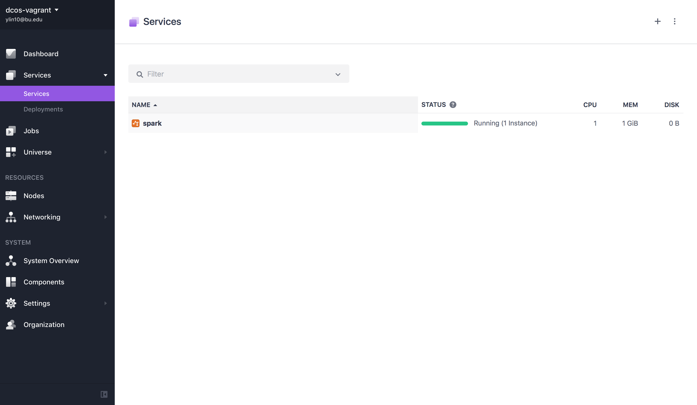
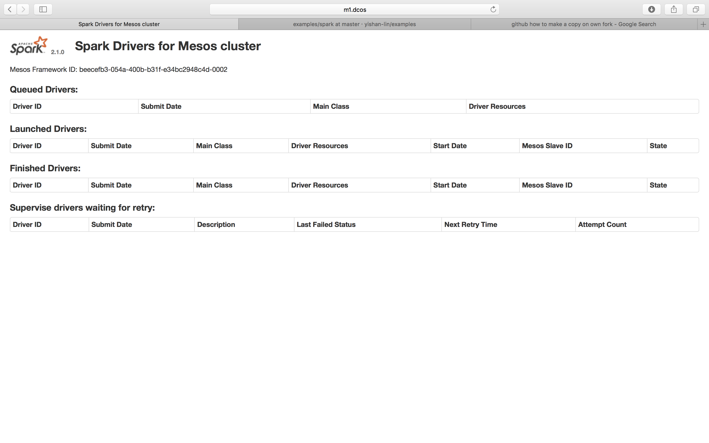
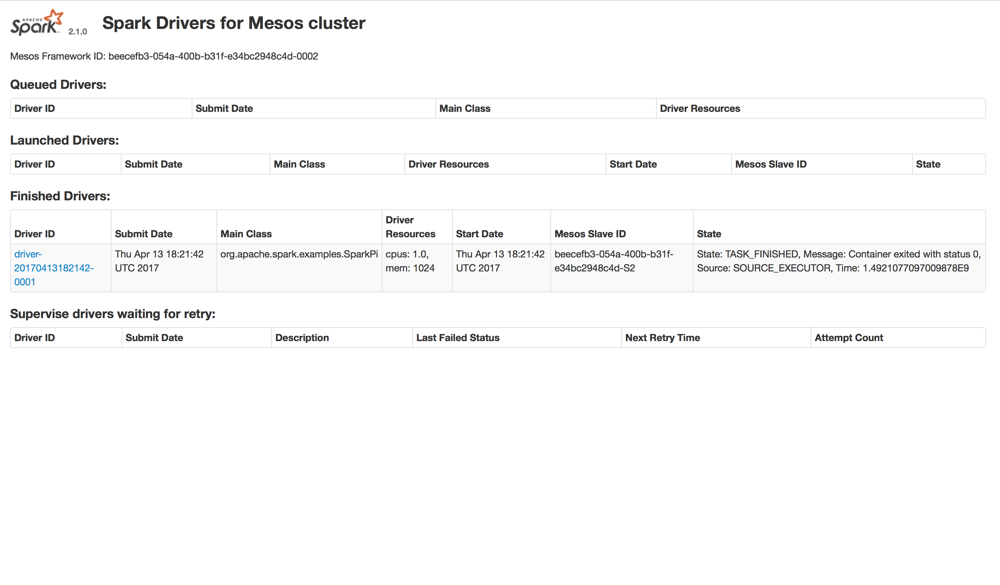

# How to use Apache Spark on DC/OS

[Apache Spark](https://spark.apache.org/) is a general-purpose data processing engine. It supports batch and stream processing and comes with built-in APIs for SQL, machine learning and graph workloads. Spark is storage-layer agnostic, meaning it doesn't come with its own storage system but provides connectors to read data from and write data into, for example, the local filesystem, HDFS, Kafka, Cassandra, Elasticsearch, and HBase.

- Estimated time for completion: 10 minutes
- Target audience: Anyone interested in a data processing engine.
- Scope: Learn how to install Spark on DC/OS and how to launch a Spark job. 

**Terminology**:

- **Application** ... A program built on Spark, consisting of a driver program and executors in the cluster.
- **Driver** ... A process running the `main()` function of the application (and providing the SparkContext).
- **Executor** ... A process launched for an application on a worker node.
- **Mesos run modes** ... Spark can run in Mesos using two modes: `coarse-grained` (default) and `fine-grained`. The `coarse-grained` mode has a lower startup overhead and is good for interactive sessions; it launches one long-running Spark task on each worked node at the cost of reserving the resources for the complete duration of the application. The `fine-grained` mode shows better resource utilization and is good for batch and certain streaming jobs; it launches each Spark task as a separate Mesos task.

**Table of Contents**:

- [Prerequisites](#prerequisites)
- [Install Spark](#install-spark)
- [Launch a Spark job](#launch-a-spark-job)
- [Uninstall Spark](#uninstall-spark)

## Prerequisites

- A running DC/OS 1.9 cluster with at least 3 nodes with each 2 CPUs and 2 GB of RAM available.
- [DC/OS CLI](https://dcos.io/docs/1.9/usage/cli/install/) installed.

## Install Spark

Assuming you have a DC/OS cluster up and running, the first step is to install Spark:

```bash
$ dcos package install spark
Installing Marathon app for package [spark] version [1.0.9-2.1.0-1]
Installing CLI subcommand for package [spark] version [1.0.9-2.1.0-1]
New command available: dcos spark
DC/OS Spark is being installed!

	Documentation: https://docs.mesosphere.com/current/usage/service-guides/spark/
	Issues: https://docs.mesosphere.com/support/
```

Note that while the DC/OS CLI subcommand `spark` is immediately available, it takes a few moments for Spark to start running in the cluster.

Let's first check the DC/OS CLI and its new subcommand `spark`:

```bash
$ dcos spark
Usage:
    dcos spark --help
    dcos spark --info
    dcos spark --version
    dcos spark --config-schema
    dcos spark run --help
    dcos spark run --submit-args=<spark-args>
                   [--docker-image=<docker-image>]
                   [--verbose]
    dcos spark status <submissionId> [--verbose]
    dcos spark log <submissionId>
                   [--follow]
                   [--lines_count=<lines_count>]
                   [--file=<file>]
    dcos spark kill <submissionId> [--verbose]
    dcos spark webui
```

Now, we validate if Spark is running and healthy, in the cluster itself. For this, go to the DC/OS UI and you should see Spark there under the `Services` tab:



You can get to this page by using the `dcos spark webui` command:



## Launch a Spark job

Now that you've set up Spark, it's time to launch your first Spark job. We will use one of the [existing examples](https://github.com/apache/spark/blob/master/examples/src/main/scala/org/apache/spark/examples/SparkPi.scala) that comes with Spark.

Note that when you execute the `dcos spark run` command the first time, DC/OS downloads the necessary assets to your local machine and that can take (depending on your Internet connection) some 10 mins or more.

```bash
$ dcos spark run --submit-args='-Dspark.mesos.coarse=true --driver-cores 1 --driver-memory 1024M --class org.apache.spark.examples.SparkPi https://downloads.mesosphere.com/spark/assets/spark-examples_2.10-1.4.0-SNAPSHOT.jar 30'
downloads.mesosphere.com/spark/assets/spark-examples_2.10-1.4.0-SNAPSHOT.jar 30'
Spark distribution spark-2.1.0-1-bin-2.6 not found locally.
It looks like this is your first time running Spark!
Downloading https://downloads.mesosphere.com/spark/assets/spark-2.1.0-1-bin-2.6.tgz...
Extracting spark distribution /Users/yishan/.dcos/spark/dist/spark-2.1.0-1-bin-2.6.tgz...
Successfully fetched spark distribution https://downloads.mesosphere.com/spark/assets/spark-2.1.0-1-bin-2.6.tgz!
127.0.0.1 - - [13/Apr/2017 11:21:42] "POST /v1/submissions/create HTTP/1.1" 200 -
127.0.0.1 - - [13/Apr/2017 11:21:42] "GET /v1/submissions/status/driver-20170413182142-0001 HTTP/1.1" 200 -
Run job succeeded. Submission id: driver-20170413182142-0001
```

Note the submission ID in the last line, above, in our example `driver-20170413182142-0001`: this allows to track the job via the CLI as we will see below. When you look at the Spark drivers page you should see the job as well:



Alternatively, you can use the CLI to verify the job status:

```bash
$ dcos spark status driver-20170413182142-0001
127.0.0.1 - - [13/Apr/2017 11:22:30] "GET /v1/submissions/status/driver-20170413182142-0001 HTTP/1.1" 200 -
Submission ID: driver-20170413182142-0001
Driver state: FINISHED
Last status: task_id {
  value: "driver-20170413182142-0001"
}
state: TASK_FINISHED
message: "Container exited with status 0"
slave_id {
  value: "beecefb3-054a-400b-b31f-e34bc2948c4d-S2"
}
timestamp: 1.4921077097009878E9
executor_id {
  value: "driver-20170413182142-0001"
}
source: SOURCE_EXECUTOR
uuid: "\021<zK\201,H\243\240\225\202T\355\004k\v"
container_status {
  network_infos {
    ip_addresses {
      ip_address: "192.168.65.111"
    }
  }
  4: "\n$798a668c-fd4a-4ac9-afc0-7d45fdcbc76e"
}


```

Now let's use `dcos spark log` to verify the execution on the CLI. While this is probably not that useful for very short-running batch jobs, it's beneficial for long-running jobs as well as Spark Streaming jobs:

```bash
$ dcos spark log driver-20170413182142-0001
Registered docker executor on 192.168.65.111
Starting task driver-20170413182142-0001
Pi is roughly 3.142276
```

So it turns out to be useful to use the `dcos spark log` command: we get the result of the computation, that is, an approximation for π, without having to dig into the logs.

## Uninstall Spark

To uninstall Spark:

```bash
$ dcos package uninstall spark
```

Use the [framework cleaner](https://docs.mesosphere.com/1.8/usage/managing-services/uninstall/#framework-cleaner) to remove your Spark instance from ZooKeeper and to destroy all data associated with it. The script requires several arguments, the values for which are derived from your service name:

- `framework-role` is `spark-role`
- `framework-principal` is `spark-principal`
- `zk_path` is `dcos-service-spark`

## Further resources

- [DC/OS Spark Official Documentation](http://docs.mesosphere.com/1.8/usage/service-guides/spark)
- [Mesos-specific](https://spark.apache.org/docs/latest/running-on-mesos.html#configuration) configuration options for Spark
- [Mesos run modes](https://spark.apache.org/docs/latest/running-on-mesos.html#mesos-run-modes) for Spark
- A gentle introduction into [Spark on Mesos](http://www.slideshare.net/Typesafe_Inc/how-to-deploy-apache-spark-to-mesosdcos) by Lightbend
